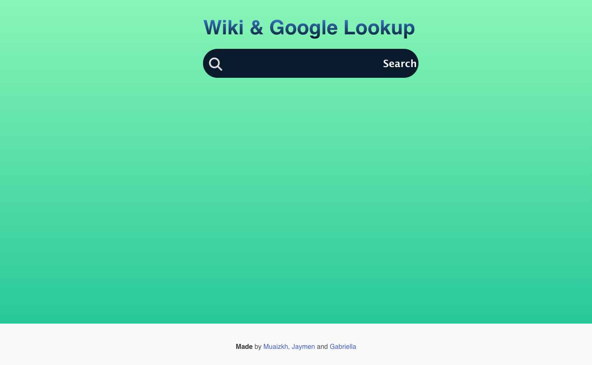

# <Wiki & Google Lookup>

## Description

Provide a short description explaining the what, why, and how of your project. Use the following questions as a guide:

The idea is to make a website which can combine both google and wikipedia search results, allowing us to have google search results but with them weighted towards wikipedia webpages. We also want to store all of our search history on the page and have it so the user can easily search for things they’ve searched for in the past. We wanted to weight wikipedia pages in searches since wikipedia pages contain lots of information and don’t have ads and such on their pages. By weighting them the user would be able to get more useful information while not missing out on their normal google search results. This is the reason for the creation of this page. To allow ourselves and others to be able to utilize a combined searcher to allow more diverse options on topics. In this project we learnt how to utilize a bootstrap alternative which in this case is Bulma, as well as creating HTML elements and using JavaScript to add functionality and with the addition of two different APIs we learnt how to integrate and utilize them effectively. 

## Usage

First install a browser to allow yourself to access the internet
Type in landing page and hit enter
Open page and type into search bar what you wish to research
Click any links that show up to allow yourself to fully access the pages that were displayed


```md

```
To add a screenshot, create an `assets/images` folder in your repository and upload your screenshot to it. Then, using the relative filepath, add it to your README using the following syntax:

    ```md
    
    ```

## Credits

The collaborators of this page are: 

Jaymen Laton: https://github.com/CanadianMRE

Muaiz Khan: https://github.com/Muaizkh

Gabriella Puente: https://github.com/puentedg

Bulma CSS: https://cdn.jsdelivr.net/npm/bulma@0.9.4/css/bulma.min.css
Font Style: https://cdnjs.cloudflare.com/ajax/libs/font-awesome/6.2.0/css/all.min.css
Google API: https://www.googleapis.com/customsearch/v1?cx=
Wikipedia API: https://en.wikipedia.org/w/api.php?action=opensearch&&origin=*&
JQuery: https://code.jquery.com/jquery-1.12.4.js, https://code.jquery.com/ui/1.13.2/jquery-ui.js


